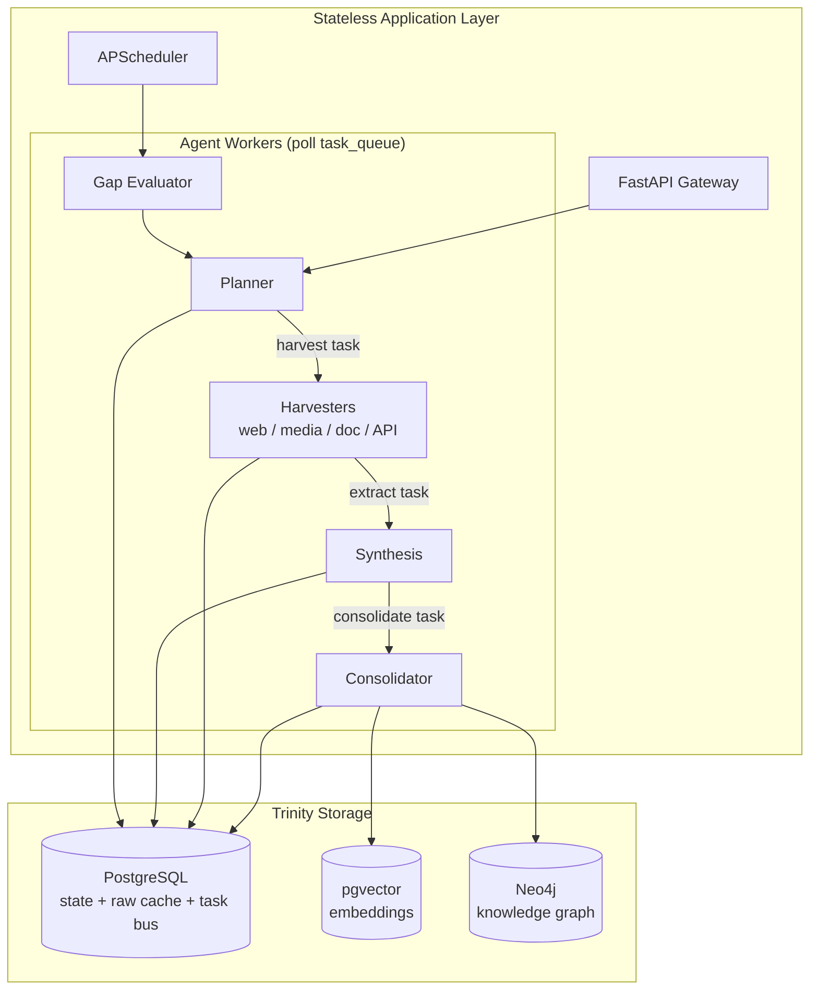

# Kryptos — GHKGE

**Generalized Hyperlocal Knowledge Graph Engine**

A domain-agnostic, strategy-adaptive, multi-agent system that acquires, validates, and consolidates hyperlocal knowledge from the open web into a queryable knowledge graph — designed to answer questions like *"Which gali is empty at 6am?"* or *"What changed in this ward's regulations this week?"*.

Kryptos is the data-intelligence layer behind [Saar](https://github.com/saketh1125/Saar) (Kashi Nav): Saar is the consumer app, Kryptos is the engine that keeps its knowledge fresh, complete, and truthful.

> **Design-first build.** The system was implemented against a locked, versioned doc set — PRD, system architecture, API contracts, data schema, compliance, extraction strategy, data quality, refresh policy, UI, observability, agent instructions, and a multi-agent protocol. Each section below links to its governing document.

---

## 1. System Architecture

Kryptos is split into a **stateless application layer** and a **Trinity Storage Layer** of managed databases:

| Store | Role |
|-------|------|
| **PostgreSQL (Supabase)** | Structured transactional state: acquisition runs, raw captures, gap queue, rate-limit state, strategy yield logs |
| **pgvector** | Semantic embeddings for narrative chunks and search queries |
| **Neo4j** | Entity linkages, path traversal, and relationship graphs |



**Governing docs:** [02_system_architecture.md](docs/02_system_architecture.md) · [SysDes-v6.md](docs/SysDes-v6.md)

---

## 2. Acquisition Pipeline

Every acquisition campaign follows the same lifecycle, tracked end-to-end as an `AcquisitionRun`:

```
Gap Evaluator ──▶ Planner ──▶ Harvester ──▶ Synthesis ──▶ Consolidator ──▶ Knowledge Graph
      ▲                                                                             │
      └──────────────────────── GapQueue ◀───────────────────────────────────────────┘
```

1. **Gap evaluation** — a scheduled job enumerates every geohash cell covering the domain bbox, then writes severity-scored entries to the `GapQueue` for empty cells (`missing`), sparse cells (`anomaly`), and entities past their staleness cutoff (`reinforce`). Nothing is crawled for its own sake; the queue is the only trigger.
2. **Planning** — the planner claims the highest-severity open gaps and ranks each entity type's YAML-declared strategies by historical yield (entities-per-call × novelty-rate).
3. **Harvesting** — pluggable sources behind one interface: `web` (httpx), `media` (yt-dlp + faster-whisper), `document` (docling), `api`/`api_overpass` (Overpass, gov portals). Every URL passes `ComplianceEngine.check()` and becomes an `ApprovedTarget` before any I/O.
4. **Extraction** — raw captures are written to Postgres *first*, then chunked (800w/150o) and converted to structured facts via instructor-validated Pydantic schemas. Macro knowledge is discarded.
5. **Consolidation** — fuzzy entity resolution (rapidfuzz, 85% threshold) merges multi-source sightings; the safety gate holds safety-relevant facts from non-official sources until corroborated; writes go Postgres → pgvector → Neo4j, rolling back Postgres if Neo4j fails.

**Governing docs:** [06_extraction_strategy.md](docs/06_extraction_strategy.md) · [12_multi_agent_protocol.md](docs/12_multi_agent_protocol.md)

---

## 3. Agentic Architecture

The engine is designed as five autonomous roles synchronized over a Postgres-backed task event bus:

| Role | Responsibility | Key module |
|------|----------------|------------|
| **Planner** | Claims gaps, ranks strategies by yield history, derives targets from the domain YAML | `ghkge/orchestrator/planner.py` |
| **Harvester** | Multi-modal acquisition behind one interface, compliance-gated | `ghkge/harvesters/` |
| **Synthesis** | Sliding-window chunking + instructor-guided LLM extraction | `ghkge/synthesis/` |
| **Consolidator** | Entity resolution, safety gate, multi-store sync with rollback | `ghkge/consolidation/` |
| **Gap Evaluator** | Scans coverage + staleness; writes severity-ranked gaps | `ghkge/gap_evaluator/evaluator.py` |

Workers poll a Postgres-backed task bus (`task_queue`, claimed with `FOR UPDATE SKIP LOCKED`). Hand-offs are `plan` → `harvest` → `extract` → `consolidate`; crashed tasks are reclaimed after a configurable timeout.

**Governing docs:** [12_multi_agent_protocol.md](docs/12_multi_agent_protocol.md) · [11_agent_instructions.md](docs/11_agent_instructions.md)

---

## 4. Data Model

Ten core tables across the Trinity Storage:

| Table | Purpose |
|-------|---------|
| `acquisition_runs` | Full run lifecycle (plan → harvest → extract → consolidate) with counters and errors |
| `raw_captures` | Cached raw content per source, content-hash deduped |
| `entities` | Resolved entities with geohash grid cell, aliases, tombstone status |
| `extracted_facts` | Structured facts with source tier, provenance, and resolution status |
| `narrative_chunks` | Semantic chunks + embeddings (pgvector) |
| `gap_queue` | Open coverage gaps driving the planner |
| `strategy_yield_log` | Per-strategy yield/novelty history for planner scoring |
| `domain_rate_limit_state` | Postgres-backed per-domain rate limiting |
| `task_queue` | Task event bus: agent hand-offs, retries, stale-task reclaim |
| `feedback` | User corrections queued for moderation |

**Governing docs:** [04_data_schema.md](docs/04_data_schema.md) · [07_data_quality_and_validation.md](docs/07_data_quality_and_validation.md)

---

## 5. API Surface

Two boundaries, both FastAPI + JSON:

| Boundary | Base | Endpoints |
|----------|------|-----------|
| **Knowledge API** (public, for consumer apps) | `/api/v1` | `GET /entities/search` · `GET /entities/{id}` · `GET /entities/{id}/nearby` · `GET /entities/{id}/rules` · `POST /feedback` |
| **Orchestration API** (internal) | `/admin/v1` | `POST /runs` (202) · `GET /runs/{run_id}` · `GET /gaps` · `POST /gaps/{gap_id}/resolve` · `GET /strategies/yield` · `GET /facts` · `POST /facts/{id}/moderate` |

`GET /entities/search` is hybrid: structured filters plus pgvector cosine ranking, degrading to substring matching when embeddings are unavailable. `near`/`radius_m` filter by true distance from the entity's grid-cell center. Only `approved` facts are ever returned; held safety facts stay invisible until a moderator acts.

**Governing doc:** [03_api_contracts.md](docs/03_api_contracts.md)

---

## 6. Domain Configuration

Kryptos is domain-agnostic: a new city or domain is a YAML file, not a new scraper. `config/default_domain.yaml`:

```yaml
domain: "example_hyperlocal_domain"
geography_bbox: [25.268, 82.980, 25.350, 83.030]
coverage_target: 0.8
grid_precision: 6
staleness_cutoff_days:
  regulatory_rule: 7
entity_types:
  - name: "landmark"
    strategies: ["osm_api", "specialized_wikis", "media_transcripts"]
    safety_relevant: false
strategy_seeds:
  official_portals: ["https://varanasi.nic.in/"]
```

Strategies map to engines in `ghkge/orchestrator/domain.py` (the single source of truth); `osm_api` needs no seeds because Overpass queries are generated per grid cell. Every seed URL still passes the compliance gate before it is fetched.

**Governing docs:** [01_prd.md](docs/01_prd.md) · [08_refresh_policy.md](docs/08_refresh_policy.md)

---

## 7. Compliance & Safety

Acquisition is legally constrained by design, not by convention:

- **Public-access-only:** indexes only what a human could legally view without login or access-control bypass
- **No private API reverse engineering** — zero interception of private/mobile endpoints
- **No deanonymization** — personal identity of creators/citizens is never stored or correlated
- **Robots-aware:** `robots.txt` enforcement (24h cache, **fail-closed** — an unreachable `robots.txt` blocks) + global denied patterns (`/admin`, `/login`, private API paths, credential params)
- **Blocked platforms:** LinkedIn, Instagram, Facebook, TikTok — official APIs only
- **Rate limiting:** Postgres-backed limiter (2s default interval) per domain; a blocked URL never consumes a rate-limit slot
- **Structural enforcement:** harvesters accept an `ApprovedTarget`, not a URL string, so the gate cannot be bypassed without changing a type signature

**Governing docs:** [05_compliance_and_legal.md](docs/05_compliance_and_legal.md) · [11_agent_instructions.md](docs/11_agent_instructions.md)

---

## 8. Observability

Structured JSON logging (structlog) throughout — every pipeline stage emits machine-parseable events (`planner.no_gaps`, `bus.task_failed`, `run.finalized`, …), ready for log aggregators.

**Governing doc:** [10_monitoring_and_observability.md](docs/10_monitoring_and_observability.md)

---

## 9. Documentation Index

| Doc | Covers |
|-----|--------|
| [01_prd.md](docs/01_prd.md) | Product requirements, objectives, scope |
| [02_system_architecture.md](docs/02_system_architecture.md) | Topology, Trinity Storage, deployment |
| [03_api_contracts.md](docs/03_api_contracts.md) | API boundaries, payloads, contracts |
| [04_data_schema.md](docs/04_data_schema.md) | Storage topology, tables, indexes |
| [05_compliance_and_legal.md](docs/05_compliance_and_legal.md) | Legal boundaries, scraping guarantees |
| [06_extraction_strategy.md](docs/06_extraction_strategy.md) | Multi-modal ingestion flow |
| [07_data_quality_and_validation.md](docs/07_data_quality_and_validation.md) | Five data-quality pillars |
| [08_refresh_policy.md](docs/08_refresh_policy.md) | Staleness thresholds, refresh priorities |
| [09_ui_design.md](docs/09_ui_design.md) | Admin console design system |
| [10_monitoring_and_observability.md](docs/10_monitoring_and_observability.md) | Structured logging, metrics |
| [11_agent_instructions.md](docs/11_agent_instructions.md) | Coding-agent implementation rules |
| [12_multi_agent_protocol.md](docs/12_multi_agent_protocol.md) | Multi-agent roles, event bus |
| [SysDes-v6.md](docs/SysDes-v6.md) | Full engineering reference v6 |

---

## 10. Project Structure

```
Kryptos/
├── main.py                     # FastAPI entrypoint
├── pyproject.toml               # deps, ruff, mypy, pytest config
├── config/
│   └── default_domain.yaml      # domain ontology + strategies + seed URLs
├── ghkge/
│   ├── api/                     # FastAPI routes (knowledge + orchestration)
│   ├── orchestrator/            # bus, workers, planner, pipeline, scheduler, domain
│   ├── harvesters/              # web, media, document, api_client
│   ├── gap_evaluator/           # coverage/staleness scanning
│   ├── consolidation/           # entity resolution, trinity sync
│   ├── synthesis/               # chunker, refiner
│   ├── compliance/              # robots engine, rate limiter
│   ├── database/                # SQLAlchemy async models, connection
│   ├── models/                  # pydantic schemas
│   ├── monitoring/              # structlog configuration
│   ├── utils/                   # geohash utilities
│   └── config/                  # settings
├── sql/schema.sql               # DDL reference
├── docs/                        # 13 design documents
└── tests/                       # pytest suite (unit + integration)
```

## 11. Quick Start

```bash
pip install -e ".[all,dev]"
cp .env.example .env   # fill in keys; engine also boots with partial config
psql "$GHKGE_DATABASE_URL" -f sql/schema.sql   # create 10 tables + pgvector
python main.py         # serves API on configured host:port
python -m pytest tests/ -v
```

On startup the app starts the four agent workers and the gap-evaluation scheduler. A full acquisition run is `POST /admin/v1/runs`; the planner agent picks it up from the queue. Domain configs live in `config/default_domain.yaml` (ontology, bbox, strategies, seed URLs, staleness thresholds).

`[all]` installs the heavy optional harvesters (crawl4ai, docling, yt-dlp + faster-whisper). Without them the engine runs the web/API paths and logs a warning for the rest.

---

## 12. Status

**Working v1.** The pipeline runs end to end on the Postgres task bus: gap-driven planning, compliance-gated multi-modal harvesting, LLM extraction, entity resolution with the safety gate, and rolled-back Trinity writes. Background workers and the gap-evaluation scheduler start with the app.

**Verified by the test suite** (143 tests): geohash utilities, the compliance engine (fail-closed robots, denylist, rate-limit ordering), planner yield scoring, the safety gate, the full plan→consolidate chain including retries, duplicates, and rollback, both API surfaces, and the gap evaluator's bootstrap/staleness/anomaly scans. Only external services are mocked; the pipeline, bus, and API run against a real database.

**Not included (out of v1 scope):** yield-weighted Stage-2 planner scoring with time decay, LLM-router planning, Scrapling/OCR fallovers, and the Next.js admin console. Postgres events are polling-based; the full task-event-bus protocol in doc 12 is implemented as a polled queue rather than push.

**Not yet run against live services.** Schema (`sql/schema.sql`) has not been applied to a real Supabase/Neo4j/Ollama instance, and no live crawl has been executed.
