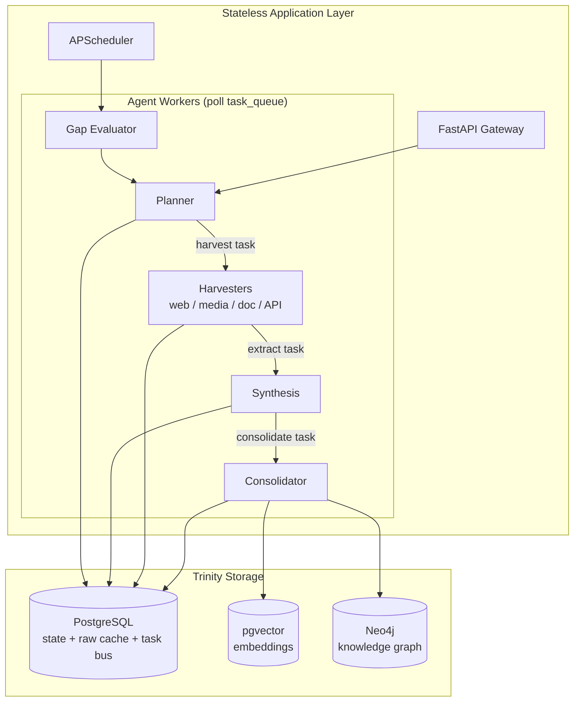

# Kryptos — GHKGE

**Generalized Hyperlocal Knowledge Graph Engine**

| Field | Value |
|---|---|
| **Repository** | [saketh1125/Kryptos](https://github.com/saketh1125/Kryptos) |
| **Package** | `ghkge` v1.0.0 · Python ≥3.11 |
| **Status** | Working v1 — **not yet run against live services** |
| **Design set** | 15 versioned documents, [document register](docs/README.md) |
| **Conformance** | [KRY-CONF-001](docs/13_conformance_matrix.md) |
| **Operations** | [KRY-OPS-001](docs/14_operations.md) |
| **Quality gates** | `ruff` clean · `mypy --strict` clean (41 modules) · 221 tests passing |

A domain-agnostic, strategy-adaptive, multi-agent system that acquires,
validates, and consolidates hyperlocal knowledge from the open web into a
queryable knowledge graph — designed to answer questions like *"Which gali is
empty at 6am?"* or *"What changed in this ward's regulations this week?"*.

Kryptos is the data-intelligence layer behind
[Saar](https://github.com/saketh1125/Saar) (Kashi Nav): Saar is the consumer
app, Kryptos is the engine that keeps its knowledge fresh, complete, and
truthful.

> **Design-first build.** Every section below links its governing document by
> stable ID. The design set is normative; the conformance matrix records where
> the implementation meets it, partially meets it, or contradicts it. Where the
> two disagree, the matrix is the honest answer — read it before trusting any
> claim in this file.

> ⚠ **The three release-blocking defects are closed** (D-01 Cypher injection,
> D-02 rate-limiter double-charge, D-03 gap lifecycle leak) — see
> [KRY-CONF-001 §4](docs/13_conformance_matrix.md). What is *not* closed is
> verification: no test has ever contacted Postgres, Neo4j, Ollama or an LLM
> provider. The logic is tested; the integration is not. Treat the first live
> deploy as the real test, and follow [KRY-OPS-001](docs/14_operations.md).

---

## 1. System Architecture

Kryptos is split into a **stateless application layer** and a **Trinity Storage Layer** of managed databases:

| Store | Role |
|-------|------|
| **PostgreSQL (Supabase)** | Structured transactional state: acquisition runs, raw captures, gap queue, rate-limit state, strategy yield logs |
| **pgvector** | Semantic embeddings for narrative chunks and search queries |
| **Neo4j** | Entity linkages, path traversal, and relationship graphs |



**Governing docs:** [KRY-ARC-001](docs/02_system_architecture.md) · [KRY-REF-001](docs/SysDes-v6.md)

---

## 2. Acquisition Pipeline

Every acquisition campaign follows the same lifecycle, tracked end-to-end as an `AcquisitionRun`:

```
Gap Evaluator ──▶ Planner ──▶ Harvester ──▶ Synthesis ──▶ Consolidator ──▶ Knowledge Graph
      ▲                                                                             │
      └──────────────────────── GapQueue ◀───────────────────────────────────────────┘
```

1. **Gap evaluation** — a scheduled job enumerates every geohash cell covering the domain bbox, then writes severity-scored entries to the `GapQueue` for empty cells (`missing`), sparse cells (`anomaly`), and entities past their staleness cutoff (`reinforce`). Nothing is crawled for its own sake; the queue is the only trigger.
2. **Planning** — the planner claims the highest-severity open gaps and ranks each entity type's YAML-declared strategies with the doc 08 §3 formula: historical yield × source-tier weight × recency decay − normalized cost. Untried strategies score a flat exploration value, so a proven strategy that has gone dry cannot permanently crowd out one that has never run.
3. **Harvesting** — pluggable sources behind one interface: `web` (httpx), `media` (yt-dlp + faster-whisper), `document` (docling), `api`/`api_overpass` (Overpass, gov portals). Every URL passes `ComplianceEngine.check()` and becomes an `ApprovedTarget` before any I/O.
4. **Extraction** — raw captures are written to Postgres *first*, then chunked (800w/150o) and converted to structured facts via instructor-validated Pydantic schemas. Macro knowledge is discarded.
5. **Consolidation** — fuzzy entity resolution (rapidfuzz, 85% threshold) merges multi-source sightings; the safety gate holds safety-relevant facts from non-official sources until corroborated; writes go Postgres → pgvector → Neo4j, rolling back Postgres if Neo4j fails.

**Governing docs:** [KRY-EXT-001](docs/06_extraction_strategy.md) · [KRY-MAP-001](docs/12_multi_agent_protocol.md)

---

## 3. Agentic Architecture

The engine is designed as five autonomous roles synchronized over a Postgres-backed task event bus:

| Role | Responsibility | Key module |
|------|----------------|------------|
| **Planner** | Claims gaps, ranks strategies by yield history, derives targets from the domain YAML | `ghkge/orchestrator/planner.py` |
| **Harvester** | Multi-modal acquisition behind one interface, compliance-gated | `ghkge/harvesters/` |
| **Synthesis** | Sliding-window chunking + instructor-guided LLM extraction | `ghkge/synthesis/` |
| **Consolidator** | Entity resolution, safety gate, multi-store sync with rollback | `ghkge/consolidation/` |
| **Gap Evaluator** | Scans coverage + staleness; writes severity-ranked gaps | `ghkge/gap_evaluator/evaluator.py` |

Workers poll a Postgres-backed task bus (`task_queue`, claimed with `FOR UPDATE SKIP LOCKED`). Hand-offs are `plan` → `harvest` → `extract` → `consolidate`; crashed tasks are reclaimed after a configurable timeout.

**Governing docs:** [KRY-MAP-001](docs/12_multi_agent_protocol.md) · [KRY-ENG-001](docs/11_agent_instructions.md)

---

## 4. Data Model

Ten core tables across the Trinity Storage:

| Table | Purpose |
|-------|---------|
| `acquisition_runs` | Full run lifecycle (plan → harvest → extract → consolidate) with counters and errors |
| `raw_captures` | Cached raw content per source, content-hash deduped |
| `entities` | Resolved entities with geohash grid cell, aliases, tombstone status |
| `extracted_facts` | Structured facts with source tier, provenance, and resolution status |
| `narrative_chunks` | Semantic chunks + embeddings (pgvector) |
| `gap_queue` | Open coverage gaps driving the planner |
| `strategy_yield_log` | Per-strategy yield/novelty history for planner scoring |
| `domain_rate_limit_state` | Postgres-backed per-domain rate limiting |
| `task_queue` | Task event bus: agent hand-offs, retries, stale-task reclaim |
| `feedback` | User corrections queued for moderation |

**Governing docs:** [KRY-SCH-001](docs/04_data_schema.md) · [KRY-DQV-001](docs/07_data_quality_and_validation.md)

---

## 5. API Surface

Two boundaries, both FastAPI + JSON:

| Boundary | Base | Endpoints |
|----------|------|-----------|
| **Knowledge API** (public, for consumer apps) | `/api/v1` | `GET /entities/search` · `GET /entities/{id}` · `GET /entities/{id}/nearby` · `GET /entities/{id}/rules` · `POST /feedback` |
| **Orchestration API** (internal) | `/admin/v1` | `POST /runs` (202) · `GET /runs/{run_id}` · `GET /gaps` · `POST /gaps/{gap_id}/resolve` · `GET /strategies/yield` · `GET /facts` · `POST /facts/{id}/moderate` |

`GET /entities/search` is hybrid: structured filters plus pgvector cosine ranking, degrading to substring matching when embeddings are unavailable. `near`/`radius_m` filter by true distance from the entity's grid-cell center. Only `approved` facts are ever returned; held safety facts stay invisible until a moderator acts.

**Governing doc:** [KRY-API-001](docs/03_api_contracts.md)

---

## 6. Domain Configuration

Kryptos is domain-agnostic: a new city or domain is a YAML file, not a new scraper. `config/default_domain.yaml`:

```yaml
domain: "example_hyperlocal_domain"
geography_bbox: [25.268, 82.980, 25.350, 83.030]
coverage_target: 0.8
grid_precision: 6
staleness_cutoff_days:
  regulatory_rule: 7
entity_types:
  - name: "landmark"
    strategies: ["osm_api", "specialized_wikis", "media_transcripts"]
    safety_relevant: false
strategy_seeds:
  official_portals: ["https://varanasi.nic.in/"]
```

Strategies map to engines in `ghkge/orchestrator/domain.py` (the single source of truth); `osm_api` needs no seeds because Overpass queries are generated per grid cell. Every seed URL still passes the compliance gate before it is fetched.

**Governing docs:** [KRY-PRD-001](docs/01_prd.md) · [KRY-RFP-001](docs/08_refresh_policy.md)

---

## 7. Compliance & Safety

Acquisition is legally constrained by design, not by convention:

- **Public-access-only:** indexes only what a human could legally view without login or access-control bypass
- **No private API reverse engineering** — zero interception of private/mobile endpoints
- **No deanonymization** — personal identity of creators/citizens is never stored or correlated
- **Robots-aware:** `robots.txt` enforcement (24h cache, **fail-closed** — an unreachable `robots.txt` blocks) + global denied patterns (`/admin`, `/login`, private API paths, credential params)
- **Blocked platforms:** LinkedIn, Instagram, Facebook, TikTok — official APIs only
- **Rate limiting:** Postgres-backed limiter (2s default interval) per domain; a blocked URL never consumes a rate-limit slot
- **Structural enforcement:** harvesters accept an `ApprovedTarget`, not a URL string, so the gate cannot be bypassed without changing a type signature

**Governing docs:** [KRY-CMP-001](docs/05_compliance_and_legal.md) · [KRY-ENG-001](docs/11_agent_instructions.md)

---

## 8. Observability

Structured JSON logging (structlog) throughout — every pipeline stage emits machine-parseable events (`planner.no_gaps`, `bus.task_failed`, `run.finalized`, …), ready for log aggregators.

**Governing doc:** [KRY-OBS-001](docs/10_monitoring_and_observability.md)

---

## 9. Documentation

The design set is normative and version-controlled. Each document carries a
stable ID, a revision, and a status; **[KRY-CONF-001](docs/13_conformance_matrix.md)**
maps every requirement to its implementation and test evidence.

| ID | Rev | Document | Status |
|---|---|---|---|
| [KRY-PRD-001](docs/01_prd.md) | 1.0 | [Product Requirements](docs/01_prd.md) | Approved |
| [KRY-ARC-001](docs/02_system_architecture.md) | 1.0 | [System Architecture](docs/02_system_architecture.md) | Approved |
| [KRY-API-001](docs/03_api_contracts.md) | 1.1 | [API Contracts](docs/03_api_contracts.md) | Implemented (partial) |
| [KRY-SCH-001](docs/04_data_schema.md) | 1.1 | [Data Schema](docs/04_data_schema.md) | Implemented (partial) |
| [KRY-CMP-001](docs/05_compliance_and_legal.md) | 1.0 | [Compliance and Legal](docs/05_compliance_and_legal.md) | Approved |
| [KRY-EXT-001](docs/06_extraction_strategy.md) | 1.0 | [Extraction Strategy](docs/06_extraction_strategy.md) | Implemented (partial) |
| [KRY-DQV-001](docs/07_data_quality_and_validation.md) | 1.0 | [Data Quality and Validation](docs/07_data_quality_and_validation.md) | Implemented (partial) |
| [KRY-RFP-001](docs/08_refresh_policy.md) | 1.0 | [Refresh Policy](docs/08_refresh_policy.md) | Implemented (partial) |
| [KRY-UI-001](docs/09_ui_design.md) | 1.0 | [UI Design](docs/09_ui_design.md) | Not implemented |
| [KRY-OBS-001](docs/10_monitoring_and_observability.md) | 1.0 | [Monitoring and Observability](docs/10_monitoring_and_observability.md) | Implemented (partial) |
| [KRY-ENG-001](docs/11_agent_instructions.md) | 1.1 | [Coding Agent Instructions](docs/11_agent_instructions.md) | Implemented |
| [KRY-MAP-001](docs/12_multi_agent_protocol.md) | 1.0 | [Multi-Agent Protocol](docs/12_multi_agent_protocol.md) | Implemented |
| [KRY-REF-001](docs/SysDes-v6.md) | 6.0 | [Technical Reference v6](docs/SysDes-v6.md) | Approved |
| [KRY-CONF-001](docs/13_conformance_matrix.md) | 1.0 | [**Conformance Matrix**](docs/13_conformance_matrix.md) | Implemented |
| [KRY-OPS-001](docs/14_operations.md) | 1.0 | [**Operations Runbook**](docs/14_operations.md) | Implemented |

**Precedence** when documents conflict: KRY-REF-001 → KRY-SCH-001 →
KRY-API-001 → KRY-PRD-001 → the rest, each binding within its own domain.
`sql/schema.sql` is the executable form of KRY-SCH-001. See the
[document register](docs/README.md) for the full precedence rules and the
one known exception.

**Status legend:** *Approved* — normative design intent. *Implemented* — built
and tested. *Implemented (partial)* — built, with a named gap. *Not
implemented* — approved, out of v1 scope.

---

## 10. Project Structure

```
Kryptos/
├── main.py                     # FastAPI entrypoint
├── pyproject.toml               # deps, ruff, mypy, pytest config
├── config/
│   └── default_domain.yaml      # domain ontology + strategies + seed URLs
├── ghkge/
│   ├── api/                     # FastAPI routes (knowledge + orchestration)
│   ├── orchestrator/            # bus, workers, planner, pipeline, scheduler, domain
│   ├── harvesters/              # web, media, document, api_client
│   ├── gap_evaluator/           # coverage/staleness scanning
│   ├── consolidation/           # entity resolution, trinity sync
│   ├── synthesis/               # chunker, refiner
│   ├── compliance/              # robots engine, rate limiter
│   ├── database/                # SQLAlchemy async models, connection
│   ├── models/                  # pydantic schemas
│   ├── monitoring/              # structlog configuration
│   ├── utils/                   # geohash utilities
│   └── config/                  # settings
├── sql/schema.sql               # DDL reference
├── docs/                        # 15 versioned documents (see docs/README.md)
└── tests/                       # pytest suite (unit + integration)
```

## 11. Quick Start

```bash
pip install -e ".[all,dev]"
cp .env.example .env          # fill in keys; set GHKGE_ADMIN_API_KEY
alembic upgrade head          # 10 tables + pgvector
python main.py                # serves API on configured host:port
```

On Supabase, append `?sslmode=require` to the DSN.

`/health` returns `{"status", "ready", "problems"}` — **gate on `ready`**, not
the status code: a degraded app still returns 200 so it stays diagnosable.

**Verify with a real run, not `/health`.** Queue one run against a single
entity type and confirm a `raw_captures` row appears; see the smoke test in
[KRY-OPS-001 §2](docs/14_operations.md#2-first-deploy).

Quality gates:

```bash
python -m pytest tests/ -v
python -m ruff check ghkge/ tests/
python -m mypy ghkge/          # strict
```

On startup the app starts the four agent workers and the gap-evaluation scheduler. A full acquisition run is `POST /admin/v1/runs`; the planner agent picks it up from the queue. Domain configs live in `config/default_domain.yaml` (ontology, bbox, strategies, seed URLs, staleness thresholds).

`[all]` installs the heavy optional harvesters: `docling` (PDF) and `yt-dlp` +
`faster-whisper` (media) are used. **`crawl4ai` is declared but never imported** —
the web harvester is httpx plus regex-based HTML stripping, which deviates from
KRY-EXT-001 §2.1 (see [KRY-CONF-001](docs/13_conformance_matrix.md) §2.1). Without
the optional extras the engine still runs the web and API paths.

---

## 12. Status

**Working v1, verified against mocks only.** The pipeline is implemented end to
end on the Postgres task bus: gap-driven planning, compliance-gated harvesting,
LLM extraction, entity resolution with the safety gate, rolled-back Trinity
writes, and NEAR edges so `/nearby` answers from the graph. Workers and the
gap-evaluation scheduler start with the app.

**What is genuinely solid:** the task bus (claiming, retries, stale-task
reclaim), the compliance engine (check ordering, fail-closed robots, blocked
URLs never consuming a rate slot, one charge per fetch), the entity resolver,
the safety gate, the KRY-RFP-001 §3 decay formula, the 10-table schema with
migrations, and both API surfaces.

**What does not exist yet:** any interaction with a real service. Zero live
fetches, zero LLM calls, zero embeddings, zero Neo4j writes. Tombstoning,
conflict resolution, metrics, backoff, containerisation, CI and retention jobs
are absent. The admin API is gated by a shared secret, not identities.

### Verification

221 tests. All run against SQLite with the true externals mocked — *except* the
compliance stack, which is now driven for real in
`test_compliance_integration.py` (real engine, real robots parser, real rate
limiter, real harvester, socket intercepted). That test is what caught D-02, and
it is confirmed to fail with the fix reverted.

Still unverified: every external I/O path, all Cypher against a live graph,
pgvector behaviour, `FOR UPDATE SKIP LOCKED` concurrency, and absolute latency.

### Defect register

Closed: **D-01** Cypher injection · **D-02** rate-limiter double-charge ·
**D-03** gap lifecycle leak · **D-04** search N+1 · **D-06** source tiers ·
**D-07** unauthenticated admin API · **D-08** silent startup (partially) ·
**D-09** pool budget · **D-10** schema application.

Open: **D-05** audit trail not persisted, graph nodes lack `raw_capture_id` ·
**D-11** retry delay inverted (inert) · **D-12** geohash cell, no coordinates
(by design; needs a migration). Full detail in
[KRY-CONF-001 §4](docs/13_conformance_matrix.md).

### Known limitations

- A safety fact from a single non-official source creates **no entity at all**;
  it is held for review and merged later if a second source corroborates it.
  With no admin console, releasing those is a manual API call.
- Facts inherit the grid cell of the gap that produced them, so entities
  straddling a cell boundary cannot merge.
- `EntityLocation` reports a geohash cell centre; `near` / `radius_m` measure
  from it, so location error is roughly ±600 m.
- NEAR edges are inferred from cell co-membership, not measured; they are
  tagged `relation_basis: "grid_cell"` so consumers can tell.
- Semantic search degrades to substring matching without Ollama; graph traversal
  falls back to same-cell neighbours without Neo4j.
- Worker loops are strictly serial, so `Semaphore(3)` is decorative and
  effective fetch concurrency is 1. A municipal bootstrap is multi-day.
- Postgres hand-offs are polled, not pushed: KRY-MAP-001 is a polled queue.

### Next steps

1. **A live smoke test** — the one thing that can confirm or refute the rest.
2. D-05 — persist the compliance audit trail; add `raw_capture_id` to nodes.
3. Conflict resolution (KRY-DQV-001 §3) — four outcomes specified, one consumed.
4. Moderator identities, tombstoning, metrics, backoff, retention.
5. Containerisation and CI.

See [KRY-OPS-001](docs/14_operations.md) for deploy procedure, log reference
and failure diagnosis.
