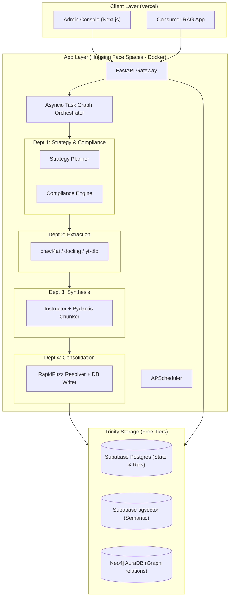

# System Architecture Document (SAD) — GHKGE

| Field | Value |
|---|---|
| **Document ID** | KRY-ARC-001 |
| **Revision** | 1.0 |
| **Status** | Approved |
| **Supersedes** | — |
| **Last updated** | 2026-09-29 |
| **Target audience** | System architects, backend engineers, infrastructure operators |
|
---

## 1. System Topology Overview
The GHKGE is split into a **Stateless Application Layer** running on free-tier container resources and a **Trinity Storage Layer** composed of cloud databases.

---

## 2. Department Design Specifications

### 2.1 Department 1: Strategy & Compliance
*   **Strategy Planner:** Reads geographical bounds and ontologies from config. Queries `gap_queue` and historical yields (`strategy_yield_log`) to calculate optimal targets and assign harvesting strategies.
*   **Compliance Engine ("The Shield"):** A deterministic compliance gate. Every URL requested must pass a `robots.txt` parse check, matching denylists, and a token-bucket rate limiter. It returns a validated target object. Under no circumstances may harvesters make direct network requests.

### 2.2 Department 2: Multi-Modal Extraction
*   Responsible for fetching and turning raw resources into text.
*   **Harvester Routers:**
    *   *HTML:* Handled by `crawl4ai` (headless browser markdown converter).
    *   *PDF/DOCX:* Handled by IBM `docling`.
    *   *Audio/Video:* Handled by `yt-dlp` and `faster-whisper`.
    *   *APIs:* Direct REST calls to Overpass API and government portals.
*   **Checkpoint writing:** Before handing content to synthesis, the harvester writes raw text and metadata to the `raw_captures` Postgres table. If synthesis crashes or is updated, we do not re-scrape.

### 2.3 Department 3: Synthesis & Refining
*   **Sliding-Window Chunker:** Chunks text into 800-word blocks with a 150-word overlap.
*   **LLM Schema Extractor:** Feeds chunks into a fast, cheap LLM model (e.g., Gemini Flash via API) wrapped with `instructor` using a Pydantic schema (`ExtractedFact`).
*   **Macro-Knowledge Filter:** Prompts contain specific guidelines to filter out global, macro facts (e.g., "The capital of France is Paris") in favor of hyperlocal facts (e.g., "Drinking fountain is situated next to the playground in City Park").

### 2.4 Department 4: Consolidation & Verification
*   **Fuzzy Entity Resolution:** Resolves raw entity names using RapidFuzz (Token Sort Ratio >= 85%).
*   **Conflict Resolver:** Employs tier weights to override stale/low-tier details. Safety-critical facts must meet a threshold of at least 2 corroborations before marking `approved`.
*   **Trinity Writer:** Executes transaction writes to Postgres (relational/provenance), pgvector (embeddings), and Neo4j (graph linkages) using batched transactions (`UNWIND` in groups of 50 for Neo4j).

---

## 3. Storage Layer Allocation (Trinity Storage)
1.  **Supabase Postgres:** Serves as the system of record for job states, execution runs, raw scraped caches, extraction details, and rate limits.
2.  **pgvector (Supabase):** Contains text chunk embeddings for hybrid search capability. Uses a 768-dimensional space (e.g., matching `nomic-embed-text`).
3.  **Neo4j AuraDB:** Stores relationships, routes, and POI paths. Ensures quick graph queries without heavy relational join queries.

---

## 4. Resource & Concurrency Control
To prevent container termination on free tiers due to memory limits (16GB RAM limit / 2 vCPUs), concurrency is tightly throttled:
*   **Serialization Rules:** Heavy operations are serialized. The system is barred from running Chromium instances concurrently with `docling` or `whisper`.
*   **Semaphores:** Headless browser processes are restricted to `asyncio.Semaphore(3)`.
*   **CPU Delegation:** `docling` layout analysis and `whisper` inference runs are wrapped in Python `ThreadPoolExecutor` and restricted to 1 concurrent instance.
*   **Stateless Container Execution:** The web container is stateless. All job states and resume indexes are read and written to Postgres, preventing state loss on container sleep cycles.
