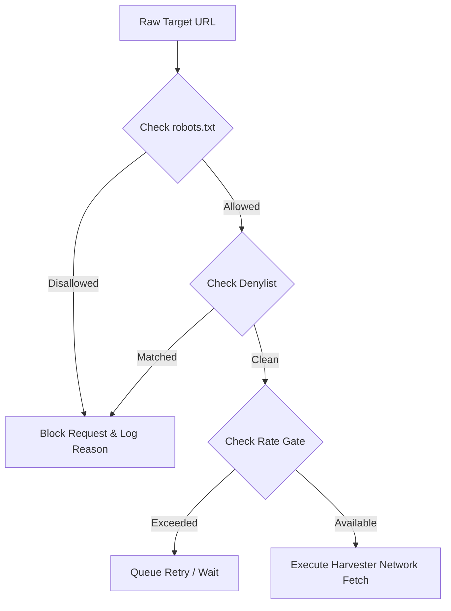

# Compliance and Legal Document — GHKGE
**Document Version:** 1.0  
**Status:** Approved  
**Target Audience:** Compliance Officers, Legal Counsel, Developers.

---

## 1. Legal Boundaries & Guarantees
The GHKGE is designed specifically to gather data while strictly adhering to data scraping laws (such as CFAA in the US and GDPR/CCPA privacy standards). The system operates on three foundational principles:
1.  **Public Accessibility:** Only index data that a human user could legally and openly access on a website without logging in or bypassing access control barriers.
2.  **No Private/Mobile API Reverse Engineering:** Zero intercept of private app traffic or mobile JSON endpoints.
3.  **Strict Personal Identity Safeguards:** Do not store, correlate, or deanonymize personal identity details of content creators or private citizens.

---

## 2. Compliance Engine Architecture ("The Shield")
Every single harvester or crawler is completely isolated from making direct network requests. Instead, all tasks fetch content via the `ComplianceEngine` using an **ApprovedTarget** system:



---

## 3. Policy Execution Specifications

### 3.1 Robots.txt Check Logic
*   **User-Agent:** Identified as `HyperlocalKnowledgeGraphEngine/1.0 (+https://github.com/saketh1125/ghkge)`
*   **Cache Duration:** 24 hours. The compliance engine queries standard `/robots.txt` paths, caches constraints in Postgres, and invalidates daily.
*   **Fallback Policy:** If robots.txt cannot be fetched (e.g., 500 server error), the domain is treated as completely blocked to prevent accidental intrusion.

### 3.2 Denylist Configuration Heuristics
The system maintains a regex denylist stored in a CSV/table configuration:
*   *Global Denied Regex:* Includes password entry portals, search parameter endpoints, admin consoles, and private subdirectories (`/admin/`, `/login/`, `/api/v2/private/`).
*   *Platform Bans:* Full bans on platforms known to sue or ban scraping (e.g., LinkedIn, Instagram, Facebook). These must only be queried if an official developer API token is configured in system secrets.

### 3.3 Persisted Postgres Token Bucket (Rate Limiter)
To survive HF Space restarts and prevent overwhelming target sites, rate limits are managed directly in Postgres:

```python
# compliance/rate_limiter.py
import urllib.parse
from datetime import datetime, timezone
import asyncpg

class PostgresRateLimiter:
    def __init__(self, db_pool: asyncpg.Pool):
        self.pool = db_pool

    async def acquire(self, url: str, limit_interval_s: float = 2.0) -> bool:
        """
        Uses a Postgres transactional query to check and update domain rate limits.
        Guarantees that two parallel worker tasks respect the rate gate.
        """
        domain = urllib.parse.urlparse(url).netloc
        now = datetime.now(timezone.utc)
        
        async with self.pool.acquire() as conn:
            async with conn.transaction():
                # Fetch or insert domain rate state
                row = await conn.fetchrow(
                    """
                    SELECT last_hit_at 
                    FROM domain_rate_limit_state 
                    WHERE domain = $1 
                    FOR UPDATE
                    """,
                    domain
                )
                
                if row:
                    last_hit = row['last_hit_at']
                    time_since_last_hit = (now - last_hit).total_seconds()
                    if time_since_last_hit < limit_interval_s:
                        # Too fast, reject request
                        return False
                
                # Update rate limiter timestamp
                await conn.execute(
                    """
                    INSERT INTO domain_rate_limit_state (domain, last_hit_at, tokens_remaining)
                    VALUES ($1, $2, 1.0)
                    ON CONFLICT (domain) 
                    DO UPDATE SET last_hit_at = $2
                    """,
                    domain, now
                )
                return True
```

---

## 4. Compliance Audits & Logging
Every execution run logs its compliance check outcomes in Postgres:
*   **Allowed Runs:** Written with corresponding validation hash values.
*   **Blocked Runs:** Recorded in `strategy_yield_log` with failure reasons (`robots_disallow`, `denylisted_domain`, `rate_limited`, `api_only_platform`).
This audit trail guarantees that if a site operator requests an extraction audit, the system can instantly verify exactly how many hits were made, when, and how the target's `robots.txt` rules were parsed.
