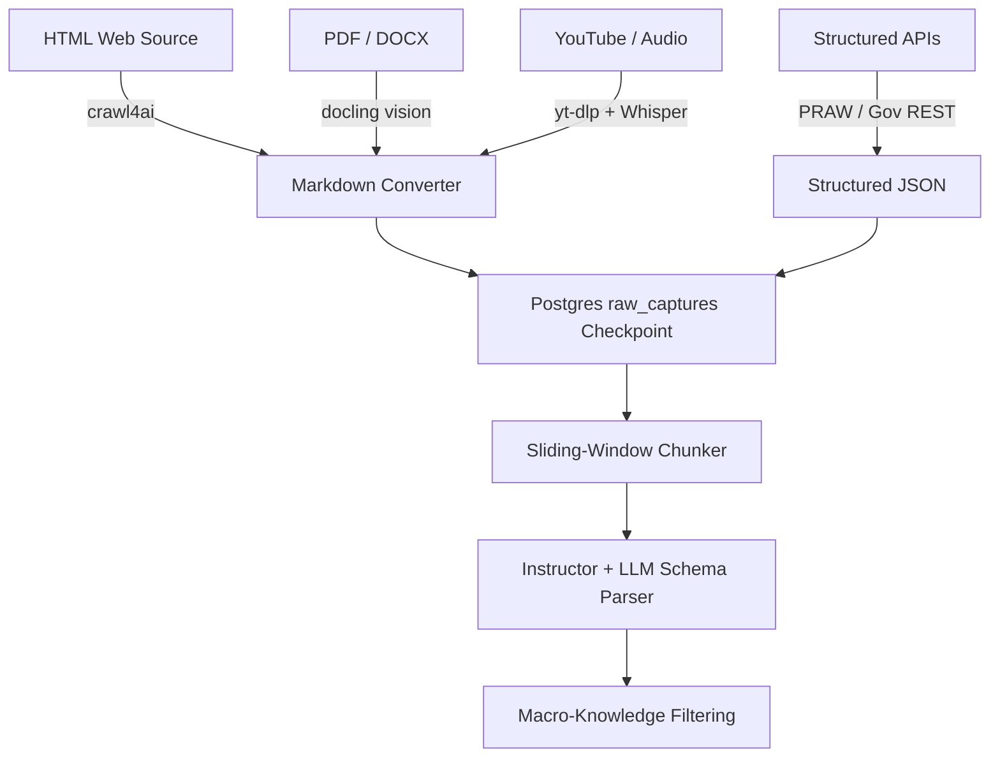

# Extraction Strategy Document — GHKGE
**Document Version:** 1.0  
**Status:** Approved  
**Target Audience:** Harvester Developers, NLP Engineers, LLM Engineers.

---

## 1. Multi-Modal Ingestion Flow
GHKGE uses a multi-modal harvesting strategy to handle different sources. The raw bytes are transformed into clean text, cached in Postgres, and synthesized into structured facts.



---

## 2. Harvester Detailed Configurations

### 2.1 HTML/Web Harvester
*   **Primary Engine:** `crawl4ai`. Configured to run in async mode, ignoring images, using block-media directives, and outputting clean GitHub-Flavored Markdown.
*   **Stealth Failover:** If `crawl4ai` encounters cloudflare protection blocks (e.g., status 403), it raises a failover flag. The orchestrator spawns `Scrapling` as a stealth browser wrapper (only as a backup to conserve resources).

### 2.2 Document Harvester (PDF / Word)
*   **Engine:** IBM `docling`.
*   **Execution:** Runs layout extraction to identify tables, footnotes, and headers.
*   *Resource Guardrail:* Since docling uses a vision-layout model, it uses high CPU and RAM. It must run inside a Python `ThreadPoolExecutor` and is strictly restricted to **one concurrent document parsing task** at a time.

### 2.3 Audio/Video Media Harvester
*   **Fetch Engine:** `yt-dlp` (extracts low-bitrate m4a/mp3).
*   **Transcribe Engine:** `faster-whisper` (CTranslate2 build) running the `whisper-large-v3-turbo` model.
*   *Optimization:* Int8 quantization is enabled (`compute_type="int8"` on CPU) to keep RAM usage below 1.5GB.

---

## 3. Facts Ingestion & Processing

### 3.1 Sliding-Window Chunker
Markdown texts are split into windows to prevent context loss across LLM boundaries:
*   **Window Size:** 800 words.
*   **Overlap Size:** 150 words (to keep sentences continuous at boundaries).

### 3.2 Schema Extraction & Pydantic Structuring
We use the `instructor` library to force the LLM to output a precise schema. Below is the validator structure:

```python
from pydantic import BaseModel, Field, field_validator
from typing import Literal

class ExtractedFact(BaseModel):
    entity_name: str = Field(description="Canonical local name of the entity.")
    entity_category: Literal["LOCATION", "ORGANIZATION", "EVENT", "RULE", "METADATA"]
    is_macro_knowledge: bool = Field(
        description="True if this fact is global knowledge not specific to the local region."
    )
    is_safety_relevant: bool = Field(
        description="True if this outlines laws, hazards, rules, prohibitions, or guidelines."
    )
    contextual_insight: str = Field(
        description="Crucial hyperlocal fact (e.g. 'Clean drinking water is available via tap 2.')."
    )
    confidence_score: float = Field(ge=0.0, le=1.0)

    @field_validator("entity_name")
    @classmethod
    def clean_name(cls, v: str) -> str:
        return v.strip().title()
```

### 3.3 Macro-Knowledge Filtering Policy
To keep the knowledge graph hyper-focused on local data, the extraction prompt includes instructions to filter general facts:
*   *Allowed Fact:* "The drinking water tap at Central Park Playground is turned off during winter months."
*   *Blocked Fact (Macro-knowledge):* "Water is composed of oxygen and hydrogen."
*   If `is_macro_knowledge` evaluates to `True`, the database writer automatically discards the fact from graph insertion to save storage and LLM tokens.
