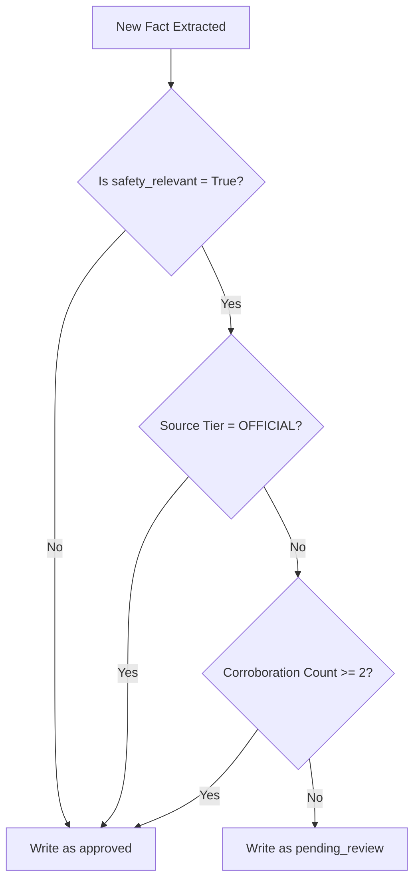

# Data Quality and Validation Spec — GHKGE
**Document Version:** 1.0  
**Status:** Approved  
**Target Audience:** Data Quality Engineers, Database Developers, API Integrators.

---

## 1. Data Quality Pillars
The GHKGE enforces data quality across five pillars to prevent garbage-in-garbage-out downstream RAG hallucinations:

| Pillar | Requirement | Implementation |
|---|---|---|
| **Provenance** | 100% audit trail. | Every node/edge links to a `raw_capture_id` and a `source_url`. |
| **Consistency** | Canonical entity naming. | RapidFuzz entity matching with unified database writes. |
| **Accuracy** | Conflicting info reconciliation. | Source-tier override precedence. |
| **Integrity** | Safety verification. | Strict corroboration thresholds (N>=2) for rules and hazard data. |
| **Timeliness** | Freshness monitoring. | Exposes a gap evaluator to flag stale entries for refresh. |

---

## 2. Entity Resolution & Merging Rules
When a new fact is parsed, it is compared against existing canonical entities in the destination bounding box:
1.  **Search Bounding Box:** Find existing entities within the target grid cell.
2.  **String Matching:** Calculate the `RapidFuzz.fuzz.token_sort_ratio` between the incoming `entity_name_raw` and existing `canonical_name` / `aliases` records.
3.  **Threshold (85%):**
    *   *If Match >= 85%:* Merge. The incoming entity is mapped to the existing `entity_id`. The new name is appended to the `aliases` string array if not already present.
    *   *If Match < 85%:* A new canonical entity record is initialized.

---

## 3. Conflict Resolution Matrix
When facts from different runs or source urls conflict (e.g., one site lists a park opening hour as 8:00 AM, another lists 9:00 AM), conflicts are resolved using a **Precedence Hierarchy**:

| Tier | Name | Target Sources | Precedence Rank | Action on Conflict |
|---|---|---|---|---|
| **1** | **OFFICIAL** | Government Portals, OpenStreetMap, Official registries. | Highest (1) | Instantly overrides lower-tier data. |
| **2** | **CURATED** | Specialized local wikis, established blog guides. | Medium-High (2) | Overrides social tiers. Appends as alternative to Tier 1. |
| **3** | **SOCIAL_VERIFIED** | Local community leaders, established forum boards. | Medium (3) | Overrides anonymous social data. |
| **4** | **SOCIAL_GENERAL** | Forums, generic social media remarks. | Lowest (4) | Flagged for manual review if contradicting higher tiers. |

---

## 4. Safety-Relevant Fact Gates
Safety-critical facts (rules, laws, physical safety hazards) cannot be automatically displayed by the Knowledge API upon single-source extraction. They are subjected to a strict gate:

*   **Trigger Rules:** Downstream consumer queries will only fetch safety rules that are marked `approved`. Facts marked `pending_review` are hidden until a matching run finds corroborating data or a moderator updates its status.
