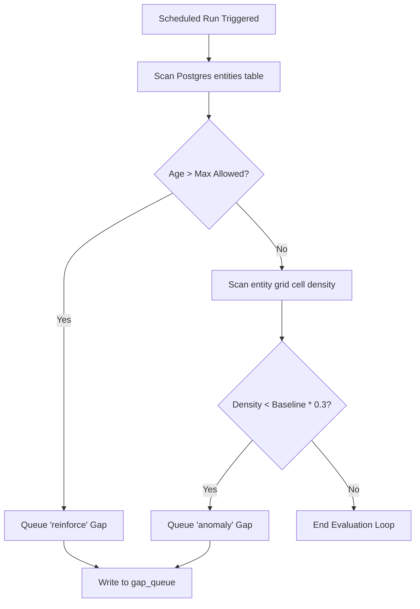

# Refresh Policy Document — GHKGE

| Field | Value |
|---|---|
| **Document ID** | KRY-RFP-001 |
| **Revision** | 1.0 |
| **Status** | Implemented (partial) |
| **Supersedes** | — |
| **Last updated** | 2026-09-29 |
| **Target audience** | Infrastructure operations, DBAs, data curators |
|
---

## 1. Refresh & Freshness Objectives
Hyperlocal data changes at varying intervals. To prevent serving stale information while avoiding expensive redundant scraping cycles, GHKGE classifies entities and configures custom **Staleness Thresholds**:

| Entity Category | Example | Max Allowed Age | Refresh Priority |
|---|---|---|---|
| **Regulatory / Safety** | Fire bans, swimming rules. | 7 Days | Critical (P0) |
| **Events** | Public festivals, markets. | 24 Hours | High (P1) |
| **Local Business** | Operating hours, locations. | 30 Days | Medium (P2) |
| **Landmark / POI** | Parks, historic bridges. | 90 Days | Low (P3) |

---

## 2. Gap & Coverage Evaluator Runbook
Instead of evaluating freshness inline during query time, the system uses a **Gap & Coverage Evaluator** background worker:

---

## 3. Dynamic Strategy Decay Scoring
To prevent routing queries to outdated or high-cost crawlers, the planner recalculates strategy yields dynamically on every run using the `strategy_yield_log` database logs:

$$\text{Strategy Score} = (\text{Historical Yield} \times \text{Tier Weight} \times \text{Recency Decay}) - \text{Normalized Cost}$$

Where:
*   **Historical Yield:** Entities found per call.
*   **Recency Decay:** An exponential decay factor ($e^{-\lambda t}$) reducing scores if the crawler hasn't successfully run in over 30 days.
*   **Normalized Cost:** The token spend associated with the crawler's synthesis layer.

---

## 4. Node Archival / Tombstoning Strategy
To avoid losing historic audit trails, entities are never deleted directly from Postgres:
*   **Tombstone Flagging:** If an entity is confirmed as permanently closed or removed, its Postgres record status is updated to `archived`.
*   **Graph Removal:** The corresponding Neo4j node and relations are deleted to keep the traversal graph clean.
*   **Semantic Vector Removal:** The embeddings are removed from `narrative_chunks` to prevent returning the entity in semantic RAG queries.
*   **Audit Preserves:** The original `raw_captures` and `extracted_facts` records are kept in Postgres, maintaining provenance history.
