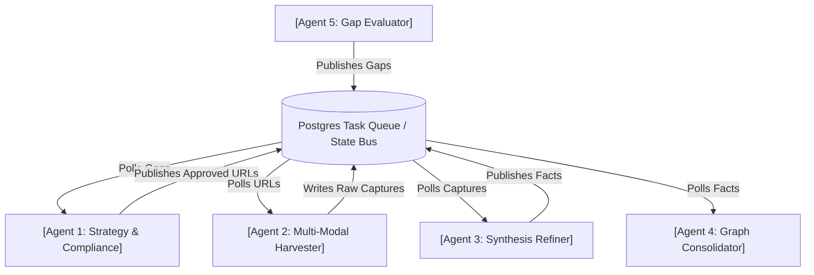
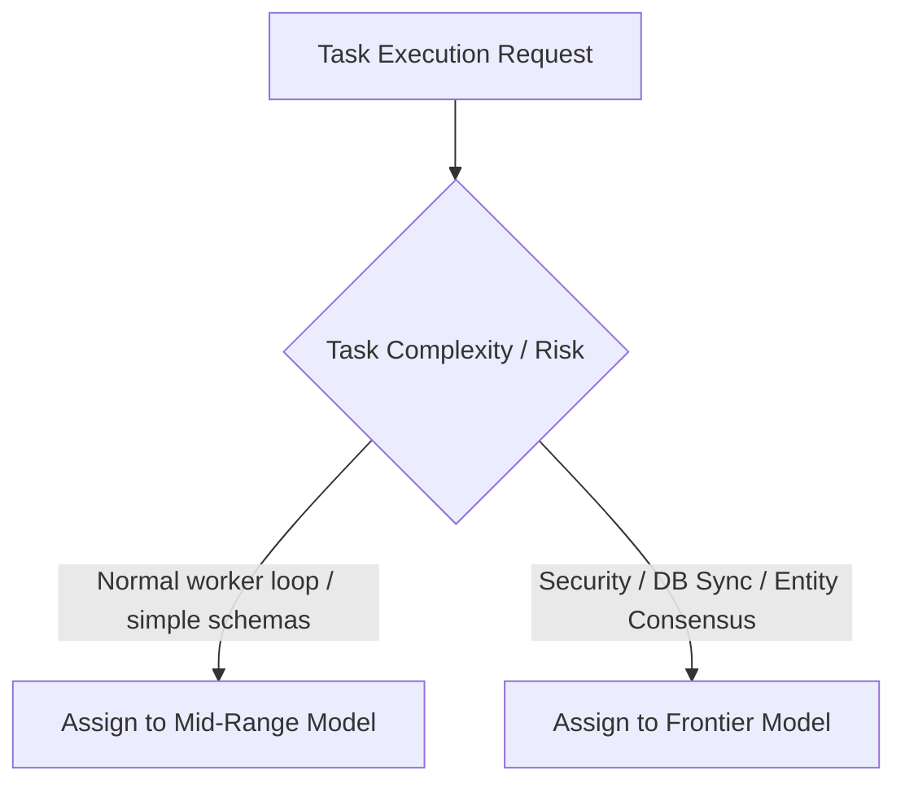

# Multi-Agent Orchestration & Collaboration Protocol — GHKGE
**Document Version:** 1.0  
**Status:** Approved  
**Target Audience:** Autonomous Agents, Multi-Agent Frameworks (LangGraph, CrewAI, Autogen, Custom subagents).

---

## 1. Multi-Agent Topology
To implement GHKGE as a multi-agent system, the backend is split into five distinct autonomous roles operating over the **Trinity Storage Layer** and synchronized via a Postgres-backed **Task Event Bus**.



---

## 2. Agent Operational Rules & Protocols

### 2.1 Agent 1: Strategy & Compliance Agent (The Gatekeeper)
*   **Mandate:** Translate geographical targets and gaps into a prioritized, legally compliant URL queue.
*   **System Prompt / Rules:**
    1.  **Compliance-First:** You are prohibited from sending any target to the queue without validating robots.txt cache patterns and rate limits in `domain_rate_limit_state`.
    2.  **Rate Constraints:** Enforce a minimum 2.0-second delay per domain.
    3.  **ToS Safe-Harbor:** Block crawling on platforms hostile to scraping (e.g., LinkedIn, Instagram, Facebook). Route requests to official API endpoints instead.
    4.  **Priority Scoring:** Sort tasks using the formula: `(novelty_rate * weight) / cost`.

### 2.2 Agent 2: Multi-Modal Harvester Agent (The Collector)
*   **Mandate:** Execute compliance-approved fetches and store raw bytes safely.
*   **System Prompt / Rules:**
    1.  **Zero-Loss Ingestion:** You must save the raw result (`raw_content` and metadata) to `raw_captures` before performing any cleanup.
    2.  **Engine Routing:** Parse HTML using `crawl4ai` or `Scrapling`; parse PDF layouts using `docling`; parse audio/video using `faster-whisper`.
    3.  **Concurrency Caps:** Do not run more than 3 Chromium browser instances or 1 CPU inference task concurrently.

### 2.3 Agent 3: Synthesis Refiner Agent (The Analyst)
*   **Mandate:** Extract structured facts from raw captures using predefined schemas.
*   **System Prompt / Rules:**
    1.  **Semantic Chunking:** Chunk raw text into 800 words with 150-word overlaps.
    2.  **Strict Typing:** Ensure every output matches the `ExtractedFact` Pydantic model.
    3.  **Macro-Knowledge Cutoff:** Reject generic, non-local facts (e.g., "Water boils at 100°C") by setting `is_macro_knowledge = True`.

### 2.4 Agent 4: Graph Consolidator Agent (The Writer)
*   **Mandate:** Resolve entities, reconcile data conflicts, and synchronize write transactions across Trinity Storage.
*   **System Prompt / Rules:**
    1.  **Fuzzy Deduplication:** Compare names against existing nodes using `RapidFuzz` (Token Sort Ratio >= 85%).
    2.  **Precedence Engine:** Resolve conflicting properties by using source tiers: `OFFICIAL (1) > CURATED (2) > SOCIAL_VERIFIED (3) > SOCIAL_GENERAL (4)`.
    3.  **Safety Gate:** Keep safety-critical facts in `pending` status until at least 2 independent sources corroborate them.
    4.  **Transactional Sync:** Perform writes sequentially: Postgres -> pgvector -> Neo4j. Roll back Postgres if subsequent writes fail.

### 2.5 Agent 5: Gap Evaluator Agent (The Auditor)
*   **Mandate:** Monitor graph coverage, identify thin data layers, and trigger target refreshes.
*   **System Prompt / Rules:**
    1.  **Density Scans:** Scan grid cells weekly. If cell entity density drops below 30% of similar cells, queue an `anomaly` gap.
    2.  **Staleness Checks:** Queue `reinforce` tasks for items exceeding staleness limits (e.g., rules > 7 days old, landmarks > 90 days old).

---

## 3. Communication Payloads (Task Bus Envelopes)

All agents publish and consume tasks using standard JSON schemas:

```json
{
  "task_id": "9ca918ff-a02a-436f-b2cf-a87612f00a21",
  "source_agent": "Agent-2-Harvester",
  "target_agent": "Agent-3-Refiner",
  "status": "pending",
  "payload": {
    "raw_capture_id": "4da78ef1-a4ef-4cde-a128-0091aa89201f",
    "domain": "example_city_guide",
    "source_url": "https://gov.city.example/parks",
    "source_tier": 1
  },
  "created_at": "2026-06-24T18:35:00Z"
}
```

---

## 4. Conflict Resolution & Human-in-the-Loop Protocol
If agents cannot resolve a state or conflict automatically, the system pauses the event loop and requests human review:
1.  **Tied Authority:** Two facts from equal source tiers contradict each other (e.g., two official websites state different playground operating hours).
2.  **Rate Lockout:** An external domain returns code 429 or 403 repeatedly despite complying with robots.txt limits.
3.  **Validation Exceptions:** Schema validations fail continuously over three sequential retry passes.
*Action:* Flag the task as `held_for_review` and update the Admin Dashboard interface.

---

## 5. Frontier Model Task Allocation (Model Tier Constraints)
While mid-range models are optimal for extraction, chunking, and standard worker task execution, certain critical tasks must be handled exclusively by frontier models to avoid security breaches, compliance violations, and database corruption:



### 5.1 High-Risk Tasks (Frontier Only)
1.  **Orchestrator Control Loops:** Designing, modifying, or testing the main asyncio task loops, DB state changes, and queue processing logic.
2.  **Safety and Compliance Gate Policies:** Writing and maintaining robots.txt parser parameters, domain-specific crawling regex denylists, and Postgres token bucket logic.
3.  **Cross-Database Sync Transactions:** Modifying database commit rules across Postgres, pgvector, and Neo4j, especially error-handling retry and rollback procedures on Neo4j connection pool losses.
4.  **Consensus and Merge Hierarchies:** Creating string match thresholds for `RapidFuzz` resolution, entity alias array grouping, and source-tier fact overrides.

