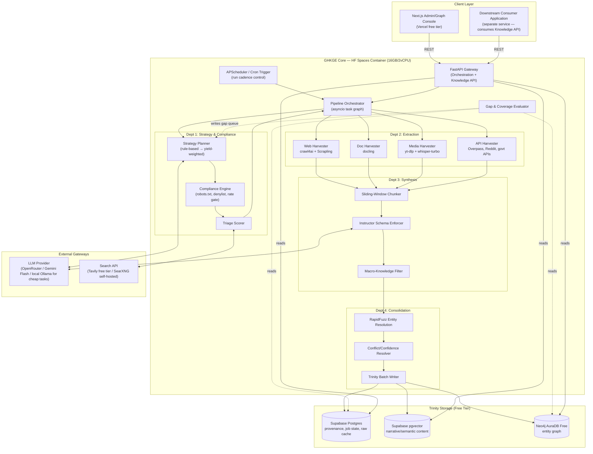

# Generalized Hyperlocal Knowledge Graph Engine (GHKGE)
**Detailed Technical Architecture v6.0 — Requirements, Components, Data Model & API Contracts**

---

## 0. Document Purpose & Scope

This is the engineering reference for GHKGE: a domain-agnostic, strategy-adaptive data acquisition and knowledge graph framework. GHKGE is designed to ingest, process, and consolidate hyperlocal information for any arbitrary domain. Concrete instantiations (such as city travel guides, campus information systems, or local business directories) are treated as domain-specific configurations of the framework rather than hardcoded pipeline architectures.

This doc is structured to feed directly into: a PRD (Section 1 + 2), API contracts (Section 6), data modeling work (Section 5), and an infra/ops runbook (Section 8). Sections are independently referenceable.

**Explicit non-goals (carried forward from v4, stated here permanently):** This system does not perform traffic interception of private/mobile APIs, cross-platform identity correlation (deanonymization) of content creators or private individuals, or retrieval of non-publicly-indexed/leaked documents via dorking. These were considered and deliberately excluded — not because of execution risk, but because the actions themselves are out of bounds regardless of stated intent. Every source this system touches is one a human could legally and openly view in a browser without bypassing access controls.

---

## 1. Requirements

### 1.1 Functional Requirements

| ID | Requirement |
|----|---|
| FR-1 | Accept a domain definition (ontology + geography) and produce a structured, queryable knowledge base without per-domain pipeline rewrites |
| FR-2 | Discover and rank candidate sources for a given entity-type/location gap |
| FR-3 | Extract structured facts from HTML, PDF/DOCX, audio/video, and API-native sources |
| FR-4 | Normalize extracted facts into a fixed schema with provenance (source URL, source tier, extraction timestamp, confidence) |
| FR-5 | Resolve duplicate/aliased entities across sources into canonical nodes |
| FR-6 | Detect coverage gaps (missing entities, thin/stale entities) and re-trigger targeted acquisition |
| FR-7 | Serve the consolidated knowledge graph via API for downstream consumption (e.g. the consumer application's LLM guide or RAG query engine) |
| FR-8 | Track per-strategy yield (entities/call, novelty rate) to inform future routing decisions |
| FR-9 | Respect robots.txt, rate limits, and a configurable domain denylist on every fetch |

### 1.2 Non-Functional Requirements

| Category | Target |
|---|---|
| **Cost** | $0 infra spend (free-tier compute/storage); LLM token spend is the one accepted variable cost |
| **Compute envelope** | Single container, 16GB RAM / 2vCPU (Hugging Face Spaces free tier, or equivalent) |
| **Latency** | Not user-facing/real-time — acquisition is a background batch process. Target: full domain bootstrap time is domain-size-dependent — define per deployment (e.g., under 2 weeks of scheduled runs for typical municipal-scale domains) |
| **Availability** | Acquisition pipeline can be offline/sleeping between runs (stateless container). The *served* knowledge API (read path) must be highly available since the downstream consumer application depends on it live |
| **Durability** | Zero data loss on container restart/recycle — all state in persistent free-tier DBs, not in-process memory |
| **Extensibility** | New domain = new ontology config + new Strategy implementations. Core pipeline (Dept 1–4) unchanged |
| **Auditability** | Every fact traceable to exact source, exact extraction run, exact prompt version used |

### 1.3 Constraints

- Solo developer / small team, final-year project timeline — favor managed free tiers over self-hosted infra ops burden.
- No paid infrastructure (Neo4j AuraDB free tier, Supabase free tier, HF Spaces free tier).
- LLM calls go through OpenRouter or direct provider APIs — this is the one line item allowed to cost money, so the system should be *token-efficient* (minimize redundant LLM calls), not zero-LLM-call.
- Must degrade gracefully on free-tier rate limits (Neo4j write throughput, Supabase connection pool size, HF Spaces sleep/cold-start).

---

## 2. High-Level Design

### 2.1 Component Diagram



### 2.2 Data Flow Summary

1. **Trigger**: Scheduler or manual API call starts a run scoped to a domain config + optional entity-type filter (e.g. "only re-run landmark_entities").
2. **Plan**: Planner reads the gap queue (from the evaluator's last pass) and assigns strategies per gap.
3. **Comply**: Every candidate URL/source passes the Compliance Engine before any network call.
4. **Extract**: Routed to the correct harvester; raw output lands in Postgres as an immutable raw-capture row first (this is important — see §4.2), *then* proceeds to synthesis.
5. **Synthesize**: Chunked, schema-extracted via Instructor, macro-knowledge filtered out.
6. **Consolidate**: Fuzzy-matched against existing canonical entities, conflicts flagged/resolved by tier-weighting, written to Trinity in batches.
7. **Evaluate**: Gap Evaluator runs on a separate schedule (not inline — it's a batch reconciliation job), comparing coverage against ground truth/density baselines, updating the gap queue and strategy yield stats.
8. **Serve**: Knowledge API reads from Trinity to answer structured queries, semantic queries, and graph traversal queries for the consumer app.

---

## 3. Why This Shape (Trade-offs Made Explicit)

| Decision | Alternative considered | Why this choice |
|---|---|---|
| Three separate stores (Trinity) instead of one DB | Single Postgres with JSONB + pgvector extension only | Neo4j's graph traversal (multi-hop "what's near this point of interest") is painful in pure SQL recursive CTEs at scale; keeping it separate costs nothing on free tier and the right tool does the right job. Trade-off: write-path complexity (must write to 2-3 stores per fact, need idempotency) |
| Raw capture persisted *before* extraction | Extract inline, discard raw HTML/transcript | Re-running extraction (better prompt, fixed bug) without re-scraping is essential — scraping is the expensive/rate-limited step, LLM re-extraction is cheap and fast to iterate on. Costs: extra Postgres storage (acceptable on free tier for text data) |
| Gap evaluation as separate batch job, not inline per-fact | Evaluate coverage after every single write | Inline evaluation on every write is wasteful (graph-wide aggregate queries are expensive); batch reconciliation (e.g. hourly/daily) is the right cadence for a non-real-time pipeline |
| Rule-based planner first, LLM-router later (staged) | Build the LLM router immediately | Get a working, debuggable, cheap pipeline first; LLM-routing is the research contribution, not the dependency for an MVP. De-risks the timeline |
| Stateless container + externalized state | Persistent worker with in-memory queue | HF Spaces free tier *will* sleep/restart; in-memory state is data loss. Postgres-backed job queue costs nothing extra since Postgres is already in the stack |
| `instructor` + Pydantic for schema enforcement | Raw prompt + manual JSON parsing | Free, removes an entire class of brittle parsing bugs, built-in retry-on-validation-failure |

---

## 4. Department Deep Dives

### 4.1 Department 1 — Strategy, Discovery & Compliance

**Planner (Stage 1: rule-based, build first)**

Instead of hardcoding routing rules, the planner loads domain-specific strategy mappings from a configuration schema (e.g., YAML). Below is the Pydantic configuration schema that replaces any hardcoded routing table:

```python
# planner/config.py
# Pydantic schema for loading domain-agnostic strategy routing configurations.
from pydantic import BaseModel, Field

class EntityTypeConfig(BaseModel):
    name: str
    strategies: list[str] = Field(
        description="Ranked list of strategy names (harvesters) to query for this entity type"
    )
    safety_relevant: bool = False

class DomainConfig(BaseModel):
    domain: str
    geography_bbox: list[float] = Field(description="[min_lat, min_lon, max_lat, max_lon]")
    entity_types: list[EntityTypeConfig]
```

An illustrative domain configuration instance showing how strategy routing is defined:

```yaml
# config/domain_example.yaml
# Example configuration for a specific domain deployment showing the routing shape.
domain: "example_hyperlocal_domain"
geography_bbox: [25.268, 82.980, 25.350, 83.030]
entity_types:
  - name: "landmark"
    strategies: ["osm_api", "specialized_wikis", "media_transcripts"]
    safety_relevant: false
  - name: "local_business"
    strategies: ["business_directories", "web_crawls", "social_media_crawls"]
    safety_relevant: false
  - name: "public_event"
    strategies: ["official_portals", "news_feeds", "social_media_crawls"]
    safety_relevant: false
  - name: "transit_route"
    strategies: ["osm_api", "official_portals", "web_crawls"]
    safety_relevant: false
  - name: "regulatory_rule"
    strategies: ["official_portals", "news_feeds"]
    safety_relevant: true
```

Stage 2 (yield-weighted) replaces the static list with a dynamically ranked list computed at runtime:
`score = (historical_entities_per_call * tier_weight * recency_decay) - normalized_cost`
— computed from the `strategy_yield_log` table (§5.3), recalculated on each planning run, not hardcoded.

**Compliance Engine ("The Shield") — concrete implementation, not just a principle**

This needs to be a real, testable module, not a comment in the architecture doc. Minimum implementation:

```python
class ComplianceEngine:
    async def check(self, url: str, domain_config: DomainPolicy) -> ComplianceResult:
        # 1. robots.txt — cached per-domain, re-fetched every 24h
        robots = await self.robots_cache.get_or_fetch(url)
        if not robots.can_fetch(USER_AGENT, url):
            return ComplianceResult(allowed=False, reason="robots_disallow")

        # 2. denylist — exact domain + regex pattern match
        if self.denylist.matches(url):
            return ComplianceResult(allowed=False, reason="denylisted_domain")

        # 3. rate gate — token bucket per-domain, state in Postgres
        #    (not in-memory — must survive container restarts)
        if not await self.rate_limiter.acquire(domain=urlparse(url).netloc, min_interval_s=2.0):
            return ComplianceResult(allowed=False, reason="rate_limited", retry_after=...)

        # 4. ToS heuristic flag — known-hostile-to-scraping domains
        #    (LinkedIn, Instagram direct, Facebook) routed to "do not crawl"
        #    list by default; only platforms with public API access (Reddit API,
        #    YouTube via yt-dlp on public videos) are crawled directly.
        if self.platform_policy.requires_official_api(url) and not self.has_api_access(url):
            return ComplianceResult(allowed=False, reason="api_only_platform")

        return ComplianceResult(allowed=True)
```

Every harvester call goes through `ComplianceEngine.check()` first — no exceptions, including for sources that "feel safe." This is the actual gate, not the LLM strategy planner; compliance is a deterministic policy check, not a judgment call delegated to a model.

**Triage Scorer**: token-sort-ratio (RapidFuzz, same library as Dept 4 — no need for a second fuzzy-matching dependency) between the gap's target context and SERP snippet text. Threshold 0.4, configurable per entity type (raise it for safety-relevant categories like regulatory rules or public safety guidelines to reduce false-positive low-quality sources).

### 4.2 Department 2 — Multi-Modal Extraction

Confirmed open-source stack, all free:

| Source type | Tool | Notes |
|---|---|---|
| Web/HTML | `crawl4ai` | Primary. Async, JS-rendering, markdown output |
| Web/HTML (blocked) | `Scrapling` | Stealth failover only — don't run both by default, costs 2x compute |
| Documents (PDF/DOCX) | `docling` (IBM) | Vision-layout parsing; run in `ThreadPoolExecutor`, never inline in the async loop |
| Media (audio/video) | `yt-dlp` + `whisper-large-v3-turbo` (via `faster-whisper` CTranslate2 build, *not* raw HF transformers — 4x faster on CPU) | turbo, not large-v3, for the default pass — see §7 resource budget |
| Structured APIs | Direct clients: Overpass API, PRAW (Reddit), official government data portals (e.g. data.gov APIs) | No scraping needed where an API exists — always prefer this row |
| OCR fallback (scanned govt PDFs) | `Tesseract` via `docling`'s OCR backend | For image-only PDFs docling's layout model can't parse natively |

**Critical addition not in v4**: raw extraction output is written to Postgres (`raw_captures` table, §5.1) *before* being handed to Dept 3. This decouples "expensive to acquire" from "cheap to re-process," which matters a lot once you're iterating on extraction prompts — you should never need to re-scrape to fix a prompt bug.

### 4.3 Department 3 — Synthesis & Refining

Unchanged from v4 in approach (sliding window 800-word/150-word overlap, `instructor` + Pydantic), with two additions:

**Source-tier is computed here, not assumed**, and attached to every extracted fact:

```python
class SourceTier(IntEnum):
    OFFICIAL = 1       # govt portals, OSM, official registries
    CURATED = 2         # specialized wikis, established domain blogs, news
    SOCIAL_VERIFIED = 3  # Reddit/Twitter accounts with established local presence
    SOCIAL_GENERAL = 4   # general social media, anonymous blogs
```

**Safety-relevance flag** added to the schema — anything touching rules, hazards, or do's/don'ts gets flagged and held to a stricter corroboration bar before it's eligible for the "approved" write path (§4.4):

```python
class ExtractedFact(BaseModel):
    entity_name: str
    entity_category: Literal["LOCATION", "ORGANIZATION", "EVENT", "RULE", "METADATA"]
    is_macro_knowledge: bool
    is_safety_relevant: bool = Field(description="True if this concerns rules, hazards, or do's/don'ts")
    contextual_insight: str
    confidence_score: float = Field(ge=0.0, le=1.0)
    source_tier: SourceTier
    extracted_at: datetime
    source_url: str
    chunk_index: int
```

### 4.4 Department 4 — Graph Consolidation & Verification

RapidFuzz entity resolution unchanged from v4 (85% token-sort-ratio threshold). One addition: **conflict resolution logic**, which v4 didn't specify:

```python
def resolve_conflict(existing: Entity, incoming: ExtractedFact) -> Resolution:
    if incoming.source_tier < existing.best_tier:           # lower enum = higher authority
        return Resolution.OVERRIDE
    if incoming.source_tier == existing.best_tier:
        if incoming.confidence_score > existing.confidence_score + 0.15:
            return Resolution.OVERRIDE
        return Resolution.APPEND_AS_ALTERNATIVE              # store both, flag for review
    if incoming.is_safety_relevant and existing.corroboration_count < 2:
        return Resolution.HOLD_FOR_REVIEW                    # don't auto-write safety facts on single weak source
    return Resolution.APPEND_LOW_CONFIDENCE
```

Safety-relevant facts specifically require `corroboration_count >= 2` OR `source_tier <= CURATED` before being marked `approved` and surfaced to the consumer API — this is the practical version of the "safety_weight" concept from earlier discussion, implemented as a concrete gate rather than a principle.

### 4.5 Gap & Coverage Evaluator (new — not in v4 at all)

This was entirely missing from v3/v4 and is the actual adaptive part of the system. Runs as a separate scheduled job, not inline:

```python
async def evaluate_coverage(domain: DomainConfig) -> list[Gap]:
    gaps = []
    for cell in domain.grid_cells:
        for entity_type in domain.ontology.entity_types:
            if entity_type.has_ground_truth_source:  # e.g. OSM-backed
                expected = await ground_truth.count(cell, entity_type)
                actual = await pg.count_approved_entities(cell, entity_type)
                if actual < expected * domain.coverage_target:
                    gaps.append(Gap(cell, entity_type, severity=expected - actual, kind="missing"))
            else:
                density = await pg.entity_density(cell, entity_type)
                baseline = await pg.median_density_similar_cells(cell, entity_type)
                if density < baseline * 0.3:
                    gaps.append(Gap(cell, entity_type, severity=baseline - density, kind="anomaly"))

    stale = await pg.query_stale_or_thin_entities(
        max_age_days=domain.staleness_cutoff_days, min_sources=2
    )
    gaps += [Gap.from_entity(e, kind="reinforce") for e in stale]

    gaps.sort(key=lambda g: g.severity * (2.0 if g.entity_type.safety_relevant else 1.0), reverse=True)
    await pg.write_gap_queue(gaps)
    return gaps
```

---

## 5. Data Model

### 5.1 Postgres (Supabase) — Provenance, State, Raw Cache

```sql
-- Immutable raw capture, written before any LLM processing touches it
CREATE TABLE raw_captures (
    id              UUID PRIMARY KEY DEFAULT gen_random_uuid(),
    source_url      TEXT NOT NULL,
    source_type     TEXT NOT NULL,         -- 'html' | 'pdf' | 'audio' | 'api_json'
    domain          TEXT NOT NULL,
    captured_at     TIMESTAMPTZ NOT NULL DEFAULT now(),
    raw_content     TEXT,                  -- markdown/transcript text
    raw_blob_url    TEXT,                  -- pointer to object storage for binary (audio/pdf), if used
    content_hash    TEXT NOT NULL,         -- dedup guard — skip re-extraction of identical content
    strategy_used   TEXT NOT NULL,
    run_id          UUID NOT NULL REFERENCES acquisition_runs(id)
);
CREATE INDEX idx_raw_captures_hash ON raw_captures(content_hash);

CREATE TABLE acquisition_runs (
    id              UUID PRIMARY KEY DEFAULT gen_random_uuid(),
    domain          TEXT NOT NULL,
    started_at      TIMESTAMPTZ NOT NULL DEFAULT now(),
    completed_at    TIMESTAMPTZ,
    status          TEXT NOT NULL,         -- 'running' | 'completed' | 'failed' | 'partial'
    trigger         TEXT NOT NULL,         -- 'scheduled' | 'manual' | 'gap_reconciliation'
    last_canonical_id_processed UUID       -- resume pointer, per the v3/v4 statelessness guardrail
);

CREATE TABLE extracted_facts (
    id                  UUID PRIMARY KEY DEFAULT gen_random_uuid(),
    raw_capture_id      UUID NOT NULL REFERENCES raw_captures(id),
    canonical_entity_id UUID REFERENCES entities(id),  -- nullable until resolved
    entity_name_raw     TEXT NOT NULL,
    entity_category     TEXT NOT NULL,
    contextual_insight  TEXT NOT NULL,
    confidence_score    FLOAT NOT NULL,
    source_tier         SMALLINT NOT NULL,
    is_safety_relevant  BOOLEAN NOT NULL DEFAULT FALSE,
    is_macro_knowledge  BOOLEAN NOT NULL DEFAULT FALSE,
    chunk_index         INT NOT NULL,
    extracted_at        TIMESTAMPTZ NOT NULL DEFAULT now(),
    resolution_status   TEXT NOT NULL DEFAULT 'pending'  -- 'pending'|'approved'|'held_for_review'|'rejected'
);

CREATE TABLE entities (
    id              UUID PRIMARY KEY DEFAULT gen_random_uuid(),
    canonical_name  TEXT NOT NULL,
    entity_type     TEXT NOT NULL,
    grid_cell       TEXT NOT NULL,         -- geohash or custom cell ID
    aliases         TEXT[] DEFAULT '{}',
    best_tier       SMALLINT NOT NULL,
    corroboration_count INT NOT NULL DEFAULT 1,
    last_verified   TIMESTAMPTZ NOT NULL DEFAULT now(),
    neo4j_node_id   TEXT,                  -- cross-reference into graph store
    created_at      TIMESTAMPTZ NOT NULL DEFAULT now()
);
CREATE INDEX idx_entities_type_cell ON entities(entity_type, grid_cell);

CREATE TABLE strategy_yield_log (
    id              UUID PRIMARY KEY DEFAULT gen_random_uuid(),
    strategy_name   TEXT NOT NULL,
    entity_type     TEXT NOT NULL,
    run_id          UUID NOT NULL REFERENCES acquisition_runs(id),
    calls_made      INT NOT NULL,
    entities_found  INT NOT NULL,
    novel_entities  INT NOT NULL,          -- excludes duplicates of existing entities
    avg_confidence  FLOAT,
    cost_estimate_usd FLOAT,               -- for LLM-call-bearing strategies
    logged_at       TIMESTAMPTZ NOT NULL DEFAULT now()
);

CREATE TABLE gap_queue (
    id              UUID PRIMARY KEY DEFAULT gen_random_uuid(),
    grid_cell       TEXT NOT NULL,
    entity_type     TEXT NOT NULL,
    kind            TEXT NOT NULL,          -- 'missing'|'anomaly'|'reinforce'
    severity        FLOAT NOT NULL,
    status          TEXT NOT NULL DEFAULT 'open',  -- 'open'|'in_progress'|'resolved'
    created_at      TIMESTAMPTZ NOT NULL DEFAULT now()
);

CREATE TABLE domain_rate_limit_state (
    domain          TEXT PRIMARY KEY,
    last_hit_at     TIMESTAMPTZ NOT NULL,
    tokens_remaining FLOAT NOT NULL
);
```

### 5.2 pgvector — Semantic/Narrative Content

```sql
CREATE EXTENSION IF NOT EXISTS vector;

CREATE TABLE narrative_chunks (
    id              UUID PRIMARY KEY DEFAULT gen_random_uuid(),
    entity_id       UUID REFERENCES entities(id),
    raw_capture_id  UUID REFERENCES raw_captures(id),
    chunk_text      TEXT NOT NULL,
    embedding       VECTOR(768),            -- match your embedding model dim (e.g. nomic-embed-text)
    source_tier     SMALLINT NOT NULL,
    created_at      TIMESTAMPTZ NOT NULL DEFAULT now()
);
CREATE INDEX idx_narrative_embedding ON narrative_chunks
    USING ivfflat (embedding vector_cosine_ops) WITH (lists = 100);
```

Use `nomic-embed-text` via Ollama (free, local, runs fine on CPU for embedding-only workloads — much lighter than generation) rather than a paid embeddings API.

### 5.3 Neo4j — Graph Layer

```cypher
// Node
(:Entity {
  id: "uuid",
  canonical_name: "Example Landmark",
  entity_type: "poi",
  grid_cell: "geohash...",
  best_tier: 1,
  corroboration_count: 4
})

// Relationships — directional, typed, with provenance
(:Entity)-[:NEAR {distance_m: 120, source: "osm"}]->(:Entity)
(:Entity)-[:ACCESSIBLE_VIA {path_type: "trail", duration_min: 3}]->(:Entity)
(:Entity)-[:HAS_AMENITY]->(:Entity {entity_type: "facility"})
(:Entity)-[:SUBJECT_TO_RULE]->(:Rule {is_safety_relevant: true})
(:Entity)-[:PART_OF]->(:Entity {entity_type: "zone_cluster"})
```

Batched via `UNWIND` in groups of 50 (per v4's guardrail — kept).

---

## 6. API Contracts

FastAPI, OpenAPI-documented automatically. Two contract surfaces: **Orchestration API** (internal, triggers/monitors acquisition runs) and **Knowledge API** (consumer-facing, what the downstream consumer application calls).

### 6.1 Orchestration API (internal/admin)

```yaml
POST /v1/runs
  body: { domain: string, entity_types?: string[], trigger: "manual" }
  response: { run_id: uuid, status: "queued" }

GET /v1/runs/{run_id}
  response: { run_id, status, started_at, completed_at?, facts_extracted, entities_written }

GET /v1/gaps?domain={domain}&status=open&limit=50
  response: { gaps: [{ grid_cell, entity_type, kind, severity, created_at }] }

POST /v1/gaps/{gap_id}/resolve   # manual override
  body: { resolution: "skip" | "retry" }

GET /v1/strategies/yield?entity_type={type}
  response: { strategies: [{ name, entities_per_call, novelty_rate, last_run }] }
```

### 6.2 Knowledge API (consumer-facing — what the downstream consumer application calls)

```yaml
GET /v1/entities/{entity_id}
  response: {
    id, canonical_name, entity_type, aliases,
    facts: [{ insight, confidence, source_tier, is_safety_relevant }],
    location: { lat, lng, grid_cell }
  }

GET /v1/entities/search?q={text}&type={entity_type}&near={lat,lng}&radius_m={n}
  # hybrid: structured filter (type/location) + semantic search (q) against pgvector
  response: { results: [{ entity_id, canonical_name, relevance_score, snippet }] }

GET /v1/entities/{entity_id}/nearby?relation={NEAR|ACCESSIBLE_VIA|HAS_AMENITY}&depth=1
  # graph traversal — "what's near this point of interest"
  response: { nodes: [...], relationships: [...] }

GET /v1/entities/{entity_id}/rules
  # safety-relevant facts only, pre-filtered to approved + corroborated
  response: { rules: [{ insight, source_tier, corroboration_count }] }

POST /v1/feedback
  # the user-correction flywheel from earlier discussion
  body: { entity_id, correction_text, submitted_by_session }
  response: { feedback_id, status: "queued_for_review" }
```

This is the contract the downstream consumer application's RAG/agent layer should be calling at inference time — structured fact lookups and graph traversal for "what's near," hybrid search for "tell me about/recommend," never raw LLM generation without grounding through this API first.

---

## 7. Resource Budget (16GB / 2vCPU constraint)

| Task | Peak RAM | Notes |
|---|---|---|
| 3x concurrent Chromium (Playwright) | ~2.5–3.5GB | `asyncio.Semaphore(3)`, kept from v4 |
| `docling` layout parse (per doc) | ~1.5–2GB | Run in `ThreadPoolExecutor`, max 1 concurrent — do not run alongside Chromium batch |
| `faster-whisper` turbo, CPU, int8 quantized | ~1–1.5GB | int8 quantization is the key lever — full fp32 turbo is 3x heavier for marginal accuracy gain on input media audio |
| FastAPI + asyncio workers + Postgres connections | ~500MB–1GB | baseline |
| **Hard rule (kept from v4, made explicit):** | | Never run Chromium batch + docling + whisper concurrently. Orchestrator must serialize these three pools, not just rate-limit within each. |

**LLM token economy** (the one paid line item): use the cheapest viable model per task —
- Extraction (Dept 3, Instructor schema fill): small/fast model (Gemini Flash tier or equivalent) — this is the highest-call-volume LLM usage, optimize here first.
- Planner/router (Dept 1, Stage 3 LLM router): can use a stronger model since call volume is far lower (once per gap-batch, not once per chunk).
- Embeddings: local Ollama (`nomic-embed-text`), zero marginal cost regardless of volume.

---

## 8. Operational Guardrails (carried + extended from v4)

1. **Memory protection**: `asyncio.Semaphore(3)` on Chromium; serialization rule above for the three heavy pools.
2. **CPU offloading**: `docling`, `whisper` inference wrapped in `run_in_executor`.
3. **Stateless ephemerality**: all run state, rate-limit state, and resume pointers in Postgres — verified by the `acquisition_runs.last_canonical_id_processed` field and `domain_rate_limit_state` table (§5.1), not in-process memory.
4. **Graph write batching**: Neo4j writes batched at 50 via `UNWIND`.
5. **Compliance-first network access** (new, formalized): no harvester may call `aiohttp`/Playwright/`yt-dlp` directly — all network dispatch routes through `ComplianceEngine.check()` first. Enforce this at the code-architecture level (harvesters receive a pre-validated `ApprovedTarget` object, never a raw URL) so it can't be silently bypassed by a future contributor.
6. **Idempotent writes**: `content_hash` on `raw_captures` prevents re-processing identical content on re-runs; `entities` upserts via canonical-ID matching prevent duplicate graph nodes on retries.

---

## 9. What This Doc Deliberately Doesn't Cover Yet

To keep this finalizable rather than infinite: authentication/authorization for the Knowledge API, the admin console's UI design, the LLM-router (Stage 3) evaluation methodology, and the specific OSM Overpass query templates per entity type are all out of scope here and worth their own follow-up docs once this architecture is locked.
